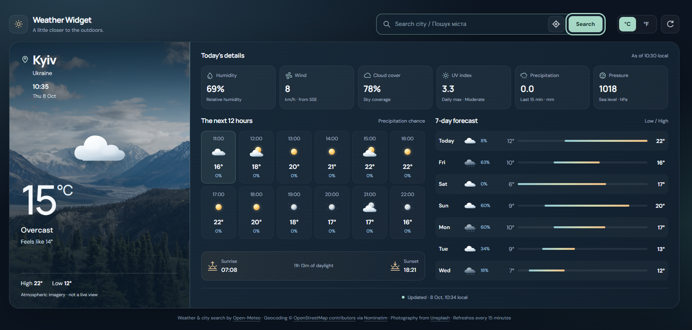

# 🌤️ Weather Widget

A responsive weather dashboard with current conditions, hourly and seven-day forecasts, atmospheric photography, and local storage persistence. Built with HTML, CSS, and vanilla JavaScript—no build step or API key required for the public services used.



## ✨ Features

### 🎨 Visual Design
- **Dark dashboard** with translucent panels and subtle gradients
- **Weather-aware backgrounds** that adapt to conditions and day/night status
- **Custom SVG weather illustrations** for clear skies, clouds, rain, snow, fog, and thunderstorms
- **Atmospheric photography** from Unsplash
- **Smooth transitions** and animated loading indicators
- **Reduced-motion support** that respects your device preferences

> Background photographs are illustrative—not live views of the selected location. Weather illustrations are not animated weather simulations.

### 🌦️ Weather Information
- **Current temperature** and feels-like temperature
- **Daily high and low**
- **Humidity**, wind speed and direction, and cloud cover
- **Daily maximum UV index**
- **Precipitation** for the current reporting interval
- **Sea-level pressure**
- **Next 12 hours** with temperatures and precipitation probabilities
- **Seven-day forecast** with temperature-range indicators
- **Sunrise, sunset, and daylight duration**
- **Local date and time** for the selected location

### 🔎 Location & Controls
- Search for cities using English, Ukrainian, or other supported place names
- Choose from matching locations when a search returns multiple results
- Use your device’s current location with permission
- Switch temperatures between **Celsius and Fahrenheit**
- Refresh the forecast manually
- Automatic refresh checks every **15 minutes** while the page is visible

### 📱 Responsive Design
- **Compact desktop layout** designed for normal 100% browser zoom
- **Side-by-side panels** for current weather and forecasts on desktop
- **Horizontal current-weather panel** on tablets
- **Single-column layout** on phones
- **Horizontally scrollable hourly forecast** on small screens
- **Touch-friendly mobile controls**
- **Keyboard focus indicators**, accessible labels, and status announcements

### 💾 Persistent State
Automatically saves to `localStorage`:
- Selected location and coordinates
- Location timezone
- Preferred temperature unit
- Latest weather response
- Last successful update timestamp

Saved forecasts less than **24 hours old** can be displayed on startup while fresh data is requested. Saved or stale data is labeled accordingly.

> Layout is selected automatically by viewport size. Weather conditions come from the forecast service rather than manual weather buttons.

## 🚀 Quick Start

### Option 1: Direct Use
Visit the live demo: [https://weatherwidget.github.io](https://weatherwidget.github.io)

### Option 2: Clone Repository
```bash
git clone https://github.com/weatherwidget/weatherwidget.github.io.git
cd weatherwidget.github.io
```

Open `index.html` in your browser.

### Option 3: Download
Download the repository ZIP, extract it, and open `index.html`.

> Device geolocation requires a secure browser context. Use the HTTPS live demo for reliable location access. City search remains available without location permission.

### Requirements
- A modern browser with JavaScript enabled
- An internet connection for fresh weather, city search, fonts, and photography
- Location permission only when using **Use my location**

No package installation or compilation is required.

## 📁 Project Structure

```text
weatherwidget.github.io/
├── index.html      # Application markup, styles, and JavaScript
├── favicon.ico     # Browser tab icon
├── README.md       # Documentation
├── LICENSE         # MIT License
└── preview.png     # Preview image
```

Keep `favicon.ico` alongside `index.html`; the application includes:

```html
<link rel="icon" type="image/x-icon" href="favicon.ico"/>
```

## 🎮 Usage

### Search for a City
1. Enter a city name in **Search city / Пошук міста**.
2. Press **Enter** or click **Search**.
3. If multiple matches appear, choose the correct location.

For ambiguous names, add a country or region. Press **Escape** to close search results.

### Use Your Current Location
1. Click the location icon beside the search field.
2. Allow location access when prompted.
3. The application loads weather for your coordinates and attempts to find the location name.

If place-name lookup fails, weather can still load using the coordinates.

### Change Temperature Units
Click **°C** or **°F** in the header. Your preference is saved automatically.

Wind remains in **km/h**, precipitation in **mm**, and pressure in **hPa**.

### Refresh Weather
Click the refresh icon in the header.

The application also checks for updates every 15 minutes while visible and checks again when you return to the tab. The footer shows the last successful update in the selected location’s local time.

### Read the Forecast
- **Today's details:** Current conditions, plus the daily maximum UV index
- **The next 12 hours:** Upcoming hourly temperatures and precipitation chances
- **7-day forecast:** Daily conditions, maximum precipitation probabilities, and low/high temperatures
- **Sun panel:** Sunrise, sunset, and daylight duration

On phones, swipe or scroll horizontally through the hourly forecast.

### Saved Data & Connection Errors
If a refresh fails, previously loaded weather remains visible and is marked as saved data. Connection errors appear above the dashboard.

This is not a fully offline application: it does not include a service worker or offline app-shell cache.

## 📊 Technical Details

### Technologies Used
- **HTML5** — Semantic page structure
- **CSS3** — Grid, Flexbox, gradients, responsive media queries, and transitions
- **Vanilla JavaScript** — Application logic without a framework
- **Inline SVG** — Interface icons and weather illustrations
- **Fetch API** — Weather and geocoding requests
- **AbortController** — Request timeouts
- **Geolocation API** — Optional device location
- **Intl.DateTimeFormat** — Location-aware dates and times
- **LocalStorage API** — Preferences and forecast persistence

### External Services

| Service | Purpose |
|---------|---------|
| [Open-Meteo Forecast API](https://open-meteo.com/) | Current conditions, hourly forecasts, and daily forecasts |
| [Open-Meteo Geocoding API](https://open-meteo.com/en/docs/geocoding-api) | Primary city search |
| [Nominatim](https://nominatim.org/) | Fallback location search and reverse geocoding |
| [Unsplash](https://unsplash.com/) | Atmospheric background photography |
| [Google Fonts](https://fonts.google.com/) | DM Sans and Manrope font families |

No API keys are configured in this implementation. Public services have usage limits and policies; review their terms before deploying for commercial use or significant traffic.

### Data & Refresh Behavior
- Requests weather in Celsius and converts displayed temperatures locally
- Requests seven days of forecast data
- Uses the forecast response’s timezone for local time formatting
- Checks for automatic refresh every **15 minutes**
- Updates the displayed clock every **30 seconds** while visible
- Stores application state under `weatherWidget.v3`
- Times out requests to avoid indefinite loading
- Uses Nominatim only for explicit searches or location lookup—not autocomplete

### Performance
- No JavaScript framework or build tooling
- No external icon library
- Preloads background photographs before displaying them
- Skips scheduled refresh checks while the page is hidden
- Retains cached weather to improve startup continuity

The application still depends on external network services for fresh data and remote visual assets.

## 🔒 Privacy

- Preferences and cached forecasts are stored locally in your browser.
- Device location is requested only after clicking the location button.
- Selected coordinates are sent to Open-Meteo to retrieve weather.
- When using device location, coordinates are also sent to Nominatim to look up the place name.
- City search text is sent to Open-Meteo and, if needed, Nominatim.
- Fonts and photographs are fetched from third-party services.
- The application code contains no analytics or tracking scripts.

## 🤝 Contributing

Contributions are welcome!

1. Fork the repository.
2. Create a feature branch:
   ```bash
   git checkout -b feature/amazing-feature
   ```
3. Make your changes and test desktop, tablet, and mobile layouts.
4. Commit your changes:
   ```bash
   git commit -m "Add amazing feature"
   ```
5. Push the branch:
   ```bash
   git push origin feature/amazing-feature
   ```
6. Open a pull request.

Please preserve keyboard accessibility, reduced-motion support, service attribution, and the favicon link.

## 🐛 Known Limitations

- Fresh weather and city searches require an internet connection.
- Public APIs may be unavailable, rate-limited, or restricted by browser/network settings.
- Device geolocation requires a secure context and user permission.
- Nominatim request spacing is enforced only within the current page—not across all visitors. Higher-traffic deployments need a service-compliant geocoding strategy.
- Stored forecasts may be outdated; check the update label before relying on them.
- Sunrise or sunset may be unavailable for some locations or dates, including polar conditions.
- Remote photographs or fonts may fail to load; gradient backgrounds and fallback fonts remain available.
- Older browsers may not support all JavaScript and CSS features.
- The dashboard is not intended for safety-critical weather decisions.

## 📄 License

MIT License.

Copyright © 2025–2026 Yuliya Kolesnikova.

See [LICENSE](LICENSE) for details. Third-party data and assets remain subject to their respective terms.

## 🙏 Acknowledgments

- [Open-Meteo](https://open-meteo.com/) — Weather forecasts and city search
- [OpenStreetMap contributors](https://www.openstreetmap.org/copyright) — Geographic data
- [Nominatim](https://nominatim.org/) — Search and reverse geocoding
- [Unsplash](https://unsplash.com/) — Atmospheric photography
- [Google Fonts](https://fonts.google.com/) — DM Sans and Manrope

---

<p align="center">
  Made with ❤️ for beautiful weather visualization
</p>

<p align="center">
  <a href="https://github.com/weatherwidget/weatherwidget.github.io/stargazers">⭐ Star this repo</a> •
  <a href="https://github.com/weatherwidget/weatherwidget.github.io/issues">🐛 Report Bug</a> •
  <a href="https://github.com/weatherwidget/weatherwidget.github.io/issues">💡 Request Feature</a>
</p>
